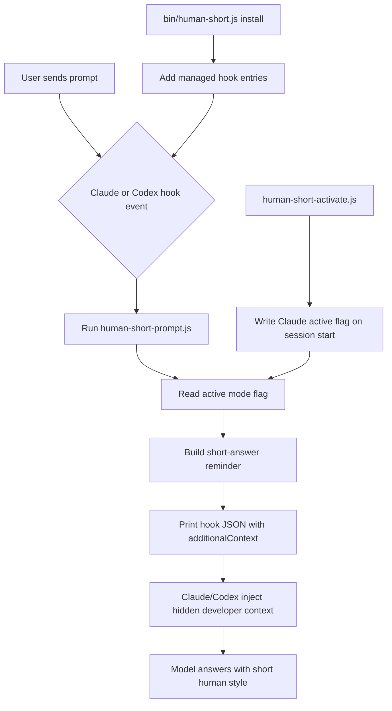

# Human Short

Human Short is a local sibling of Caveman focused on natural, short answers
instead of stylized compressed speech.

It injects a small reminder on every prompt:

```text
HUMAN_SHORT_MODE_ACTIVE
```

That marker proves the hook was loaded in hidden context.

## How It Works

The install script edits your Claude and Codex hook config and adds one managed
command: run `human-short-prompt.js` on every user prompt.

That hook reads the prompt, checks the active mode from
`~/.human-short/.claude-active` or `~/.human-short/.codex-active`, then prints
hook JSON with `additionalContext`. Claude and Codex treat that JSON as hidden
developer context for that turn, so the model gets reminded every message
instead of only once from `AGENTS.md` or `CLAUDE.md`.



## Enable And Disable

You can control it from normal chat text:

```text
enable human-short mode
turn on human short
use human-short
disable human-short
turn off human short
stop human-short
normal mode human-short
```

Or use slash-style commands:

```text
/human-short
/human-short hard
/human-short lite
/human-short explain
/human-short coding
/human-short off
```

`/human-short` with no mode turns on the configured default mode. The default is
`hard`.

Important: normal chat phrases work through the hook. The `/human-short` slash
command only works when this folder is loaded as a Claude plugin, because Claude
slash commands come from plugin `commands/*.md` files. The standalone
`node bin/human-short.js install` path installs the hooks, not the Claude plugin
catalog entry.

For one Claude session, load the plugin directly:

```bash
claude --plugin-dir /Users/azuolasbalbieris/dev/human-short
```

For Codex, use `$human-short`. It depends on Codex seeing the skill metadata at
`skills/human-short/agents/openai.yaml`; the hook also recognizes `$human-short
hard|lite|explain|coding|off` as mode commands once the Codex hook is trusted.

## Modes

`hard` is the default. It tells the model to use at most 3 sentences for normal
questions, avoid headings/bullets/examples unless asked, and count/rewrite if it
goes over.

`lite` is softer. It keeps normal grammar but cuts filler, preambles, and long
explanations.

`explain` is for simple explanations. It asks for 1-3 plain sentences with no
examples, formulas, or theory unless requested.

`coding` is for implementation sessions. Tool-work can stay clear, but the final
reply should be short: what changed and what was verified.

`off` disables the reminder for that host.

## Debug Marker

The debug marker is:

```text
HUMAN_SHORT_MODE_ACTIVE
```

It is not needed for the style itself. It is a debug proof that the hidden hook
context actually reached Claude or Codex. If a test answer is still too long, you
can search the session/transcript for this marker to tell whether the problem is
"hook did not inject" or "model ignored the instruction."

## Install

```bash
node bin/human-short.js install
```

Install one host:

```bash
node bin/human-short.js install claude
node bin/human-short.js install codex
```

### Codex Trust Step

Codex requires user approval before newly added hooks run. After installing
Codex support, open Codex once and run:

```text
/hooks
```

Trust the `human-short` `UserPromptSubmit` hook. Until that is done, `codex
exec` will ignore the hook unless you pass:

```bash
codex exec --dangerously-bypass-hook-trust ...
```

Use that flag only for local smoke tests.

## Uninstall

```bash
node bin/human-short.js uninstall
```

Default mode is `hard`. Override with:

```bash
HUMAN_SHORT_MODE=explain
```

or `~/.human-short/config.json`:

```json
{
  "defaultMode": "hard"
}
```

## Logs

Persistent logs live at:

```text
~/.human-short/logs/human-short.jsonl
```

## Doctor

```bash
node bin/human-short.js doctor
```
